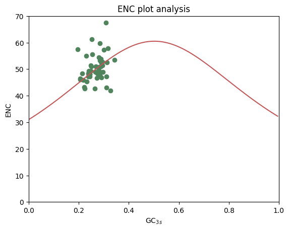
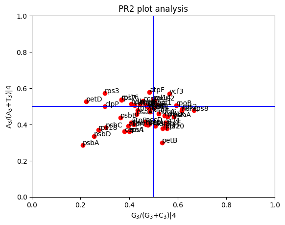
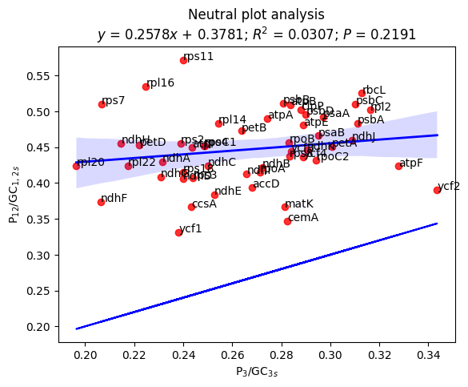
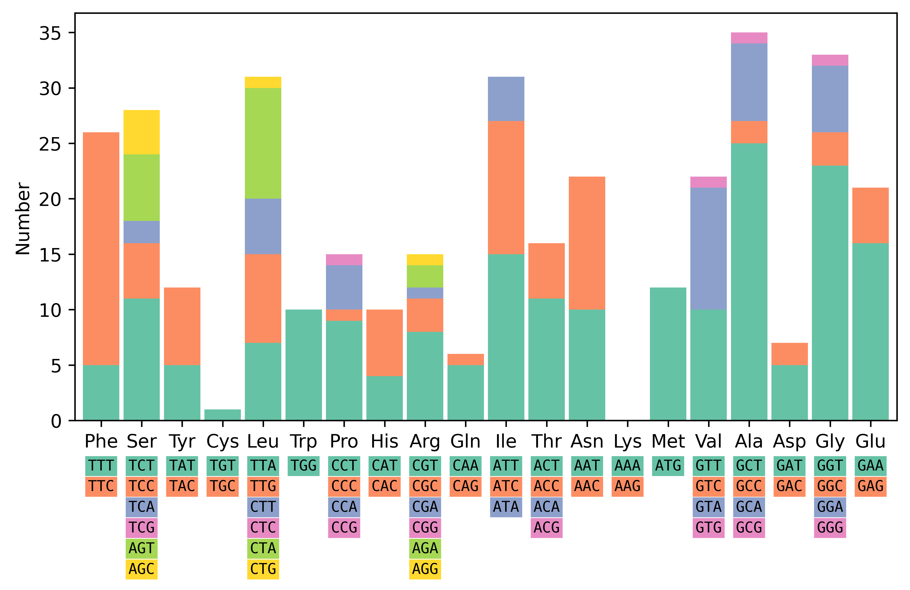
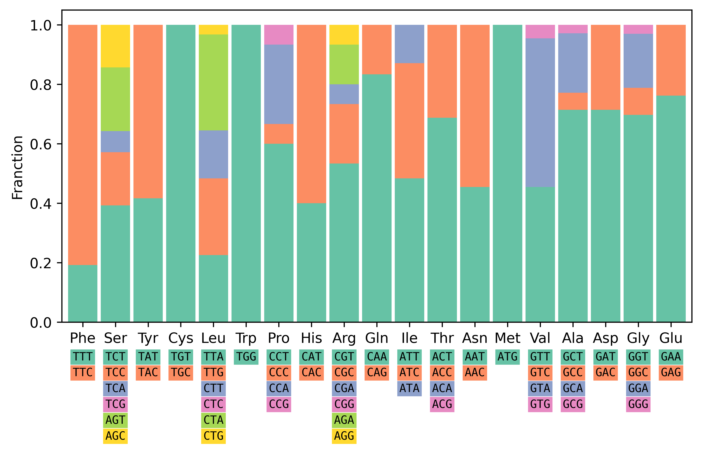
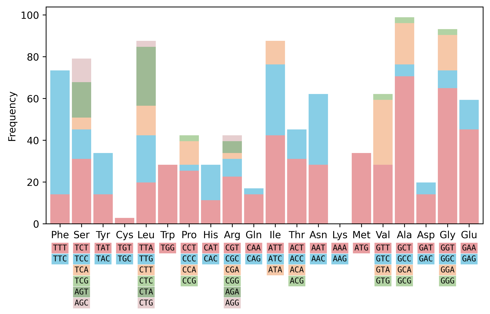
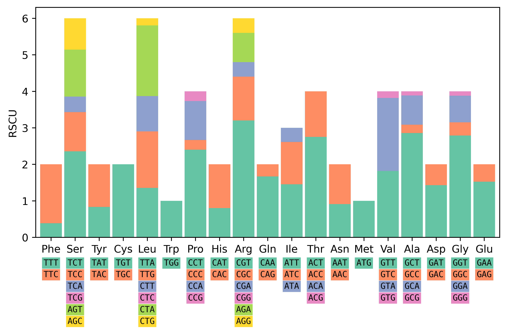

# pyCUBs: Codon Usage Bias，CUB base on python 这个库主要是研究密码子偏好性

## 已经开发和计划开发的功能列表

[Done] Observed number of occurrences of codon (Obs) analysis

[Done] Stat frequency of cusp software. cusp website: https://www.bioinformatics.nl/cgi-bin/emboss/cusp

[Done] Stat frequency of cusp software.

[Done] Relative synonymous codon usage (RSCU) analysis

[Done] Draw codon barplot

[Done] Parity rule 2 (PR2) analysis

[Done] Draw Neutrality curve

[Done] Draw ENC plot

[Done] Cups sortware anslysis

[Done part] codonW sortware anslysis


[Plan] Codon Bias Index

[Plan] Frequency of OPtimal codons

[Plan] CAI analysis

[Plan] Corresponding analysis (COA)


## 依赖和测试环境

scipy >= v1.11.4
numpy >= v1.26.3
seaborn >= v0.13.1
matplotlib >= v3.8.2
python >= v3.11.5

## 测试数据

Min.mt.fasta 数据来自这篇论文蔡元保, 杨祥燕. 澳洲坚果光壳种叶绿体基因组的密码子使用偏好性及其影响因素分析[J]. 植物科学学报, 2022, 40(2): 229-239. DOI: 10.11913/PSJ.2095-0837.2022.20229


```python
## 导入库
import sys
sys.path.append('/mnt/nfs1/jupyter/pyCUBs/pyCUBs/') # 库的路径
import pycubcore

## 切换测试工作路径, 导入测试数据
import os
os.chdir('/mnt/nfs1/jupyter/pyCUBs/')
inputfile = "./test_data/Min.mt.fasta"

## 模块介绍
"""
├── codontables.py  # 密码子表模块
├── fastaio.py      # Fasta IO 模块
└── pycubcore.py    # CUB 核心计算模块
"""
import codontables
print("\n可用的遗传密码子表：\n",codontables.CodonTables())
import fastaio
help(fastaio.FastaIO)

## 库的一些信息
print(pycubcore.__author__)
print("pycubcore的函数：", pycubcore.__all__)
print("版本号：",pycubcore.__version__)
```

    
    可用的遗传密码子表：
     Reference website: https://www.ncbi.nlm.nih.gov/Taxonomy/taxonomyhome.html/index.cgi?chapter=tgencodes
    
    Translate Tables/Genetic Codes:
     1: Standard
     2: Vertebrate Mitochondrial
     3: YeastMitochondrial
     4: Mold Mitochondrial, Protozoan Mitochondrial, Coelenterate Mitochondrial, Mycoplasma, Spiroplasma
     5: Invertebrate Mitochondrial
     6: Ciliate Nuclear, Dasycladacean Nuclear, Hexamita Nuclear
     9: Echinoderm Mitochondrial, Flatworm Mitochondrial
    10: Euplotid Nuclear
    11: Bacterial, Archaeal, Plant Plastid
    12: Alternative Yeast Nuclear
    13: Ascidian Mitochondrial
    14: Alternative Flatworm Mitochondrial
    16: Chlorophycean Mitochondrial
    21: Trematode Mitochondrial
    22: Scenedesmus obliquus Mitochondrial
    23: Thraustochytrium Mitochondrial
    24: Rhabdopleuridae Mitochondrial
    25: Candidate Division SR1, Gracilibacteria
    26: Pachysolen tannophilus Nuclear
    27: Karyorelict Nuclear
    28: Condylostoma Nuclear
    29: Mesodinium Nuclear
    30: Peritrich Nuclear
    31: Blastocrithidia Nuclear
    33: Cephalodiscidae Mitochondrial UAA-Tyr
    
    Help on function FastaIO in module fastaio:
    
    FastaIO(file: str)
        Read a fasta file path and support compressed files ending in ".gz", 
        or accept a handle of "_io.TextIOWrapper" class.
    
    Author: Guisen Chen; Email: thecgs001@foxmail.com; Date: 2024/05/17
    pycubcore的函数： ['GetObs', 'GetFranction', 'GetFrequency', 'GetRSCU', 'DrawCodonBarplot', 'GetCusp', 'GetcodonW', 'NPA', 'DrawNPA', 'GetNC', 'GetGC3s', 'ENC', 'DrawENC', 'Find4Dtv', 'GetPR2', 'PR2', 'DrawPR2']
    版本号： v0.01


```python
## example1: Effective number of codons (ENC) analysis

ENCResult = pycubcore.ENC(inputfile, Genetic_Codes=16) #Genetic_Codes=16 选择遗传密码子表16 植物叶绿体
pycubcore.DrawENC(ENCResult)
```


    

    


```python
# example2: Parity rule 2 (PR2) analysis.
PR2Result = pycubcore.PR2(inputfile, Genetic_Codes=16)
pycubcore.DrawPR2(PR2Result, show_label=True) #展示gene name
```


    

    


```python
# example3: Neutral plot analysis.
NPAResult = pycubcore.NPA(inputfile, Genetic_Codes=16)
pycubcore.DrawNPA(NPAResult, show_label=True) #展示gene name
```


    

    


```python
# example4: 计算 Obs, Franction, Frequency, RSCU

GeneName, Seqence = next(fastaio.FastaIO(inputfile))
print("输入的序列：\n")
print(">"+GeneName+"\n", Seqence, sep="")

# 计算
Obs = pycubcore.GetObs(Seqs=Seqence, Genetic_Codes=1) #Seqs这个参数可以是一个基因序列的string， 也可以是list, 如一个叶绿体的所以CDS序列的list, 从而计算整个物中Obs
Franction=pycubcore.GetFranction(Obs)
Frequency=pycubcore.GetFrequency(Obs)
RSCU=pycubcore.GetRSCU(Obs)

# 可视化
print("\n可视化：\n")
pycubcore.DrawCodonBarplot(Obs, data_type="Number")
pycubcore.DrawCodonBarplot(Franction, data_type="Franction")
pycubcore.DrawCodonBarplot(Frequency, data_type="Frequency")
pycubcore.DrawCodonBarplot(RSCU, data_type="RSCU")
```

    输入的序列：
    
    >psbA
    ATGACTGCAATTTTAGAGAGACGCGAAAGCGAAAGCCTATGGGGTCGCTTCTGTAACTGGATAACCAGCACTGAGAACCGTCTTTACATTGGATGGTTTGGTGTTTTGATGATCCCTACCTTATTGACCGCAACTTCTGTATTTATTATCGCCTTCATTGCTGCTCCTCCAGTAGATATTGATGGTATTCGTGAACCTGTTTCTGGGTCTCTACTTTACGGAAACAATATTATCTCTGGTGCCATTATTCCTACTTCTGCAGCTATAGGATTGCACTTTTACCCGATATGGGAAGCGGCATCCGTTGATGAATGGTTATACAATGGTGGTCCTTATGAATTGATTGTTCTACACTTCTTACTTGGTGTAGCTTCTTACATGGGTCGTGAGTGGGAACTAAGTTTCCGTCTGGGTATGCGCCCTTGGATTGCTGTTGCATATTCAGCTCCTGTTGCAGCTGCAACTGCTGTTTTCTTGATCTACCCAATCGGTCAAGGAAGCTTCTCTGATGGTATGCCCCTAGGAATCTCTGGTACTTTCAACTTCATGATTGTATTCCAGGCTGAGCACAACATTCTTATGCACCCATTTCACATGTTAGGTGTGGCTGGTGTATTCGGCGGCTCCCTATTCAGTGCTATGCATGGTTCCTTGGTAACTTCAAGTTTGATCAGGGAAACCACTGAAAATGAATCTGCTAATGAAGGTTACAGATTCGGTCAAGAGGAAGAAACTTATAATATCGTAGCTGCTCATGGTTATTTTGGCCGATTGATCTTCCAATATGCTAGTTTCAACAATTCTCGTTCTTTACATTTCTTCCTAGCTGCTTGGCCTGTAGTAGGTATCTGGTTCACTGCTTTAGGTATTAGTACCATGGCTTTCAACCTAAATGGTTTCAATTTCAACCAATCCGTAGTTGACAGTCAAGGTCGTGTAATTAACACTTGGGCTGATATCATCAACCGTGCTAACCTTGGTATGGAAGTTATGCATGAACGTAATGCTCACAACTTCCCTCTAGACCTAGCTGCTGTTGAAGCTCCATCCATAAATGGATAA
    
    可视化：
    


    

    


    

    


    

    


    

    


```python
# example5: 获得Cusp类似的结果
# Cusp website: https://www.bioinformatics.nl/cgi-bin/emboss/cusp

GeneName, Seqence = next(fastaio.FastaIO(inputfile))
print("输入的序列：\n")
print(">"+GeneName+"\n", Seqence, sep="")
print("\n")

Obs = pycubcore.GetObs(Seqs=Seqence, Genetic_Codes=1) 
print("Cusp结果：\n")
print(pycubcore.GetCusp(Obs, human_format=True)) #human_format=True 人类可阅读的输出，否则是机器可读
```

    输入的序列：
    
    >psbA
    ATGACTGCAATTTTAGAGAGACGCGAAAGCGAAAGCCTATGGGGTCGCTTCTGTAACTGGATAACCAGCACTGAGAACCGTCTTTACATTGGATGGTTTGGTGTTTTGATGATCCCTACCTTATTGACCGCAACTTCTGTATTTATTATCGCCTTCATTGCTGCTCCTCCAGTAGATATTGATGGTATTCGTGAACCTGTTTCTGGGTCTCTACTTTACGGAAACAATATTATCTCTGGTGCCATTATTCCTACTTCTGCAGCTATAGGATTGCACTTTTACCCGATATGGGAAGCGGCATCCGTTGATGAATGGTTATACAATGGTGGTCCTTATGAATTGATTGTTCTACACTTCTTACTTGGTGTAGCTTCTTACATGGGTCGTGAGTGGGAACTAAGTTTCCGTCTGGGTATGCGCCCTTGGATTGCTGTTGCATATTCAGCTCCTGTTGCAGCTGCAACTGCTGTTTTCTTGATCTACCCAATCGGTCAAGGAAGCTTCTCTGATGGTATGCCCCTAGGAATCTCTGGTACTTTCAACTTCATGATTGTATTCCAGGCTGAGCACAACATTCTTATGCACCCATTTCACATGTTAGGTGTGGCTGGTGTATTCGGCGGCTCCCTATTCAGTGCTATGCATGGTTCCTTGGTAACTTCAAGTTTGATCAGGGAAACCACTGAAAATGAATCTGCTAATGAAGGTTACAGATTCGGTCAAGAGGAAGAAACTTATAATATCGTAGCTGCTCATGGTTATTTTGGCCGATTGATCTTCCAATATGCTAGTTTCAACAATTCTCGTTCTTTACATTTCTTCCTAGCTGCTTGGCCTGTAGTAGGTATCTGGTTCACTGCTTTAGGTATTAGTACCATGGCTTTCAACCTAAATGGTTTCAATTTCAACCAATCCGTAGTTGACAGTCAAGGTCGTGTAATTAACACTTGGGCTGATATCATCAACCGTGCTAACCTTGGTATGGAAGTTATGCATGAACGTAATGCTCACAACTTCCCTCTAGACCTAGCTGCTGTTGAAGCTCCATCCATAAATGGATAA
    
    
    Cusp结果：
    
    #Coding GC 42.84%
    #1st letter GC 50.0%
    #2nd letter GC 43.22%
    #3rd letter GC 35.31%
    
    #Codon AA Fraction Frequency Number
    TTT	Phe	0.192	14.124	5
    TTC	Phe	0.808	59.322	21
    TCT	Ser	0.393	31.073	11
    TCC	Ser	0.179	14.124	5
    TCA	Ser	0.071	5.65	2
    TCG	Ser	0.0	0.0	0
    AGT	Ser	0.214	16.949	6
    AGC	Ser	0.143	11.299	4
    TAT	Tyr	0.417	14.124	5
    TAC	Tyr	0.583	19.774	7
    TGT	Cys	1.0	2.825	1
    TGC	Cys	0.0	0.0	0
    TTA	Leu	0.226	19.774	7
    TTG	Leu	0.258	22.599	8
    CTT	Leu	0.161	14.124	5
    CTC	Leu	0.0	0.0	0
    CTA	Leu	0.323	28.249	10
    CTG	Leu	0.032	2.825	1
    TAA	*	1.0	2.825	1
    TGA	*	0.0	0.0	0
    TAG	*	0.0	0.0	0
    TGG	Trp	1.0	28.249	10
    CCT	Pro	0.6	25.424	9
    CCC	Pro	0.067	2.825	1
    CCA	Pro	0.267	11.299	4
    CCG	Pro	0.067	2.825	1
    CAT	His	0.4	11.299	4
    CAC	His	0.6	16.949	6
    CGT	Arg	0.533	22.599	8
    CGC	Arg	0.2	8.475	3
    CGA	Arg	0.067	2.825	1
    CGG	Arg	0.0	0.0	0
    AGA	Arg	0.133	5.65	2
    AGG	Arg	0.067	2.825	1
    CAA	Gln	0.833	14.124	5
    CAG	Gln	0.167	2.825	1
    ATT	Ile	0.484	42.373	15
    ATC	Ile	0.387	33.898	12
    ATA	Ile	0.129	11.299	4
    ACT	Thr	0.688	31.073	11
    ACC	Thr	0.312	14.124	5
    ACA	Thr	0.0	0.0	0
    ACG	Thr	0.0	0.0	0
    AAT	Asn	0.455	28.249	10
    AAC	Asn	0.545	33.898	12
    ATG	Met	1.0	33.898	12
    GTT	Val	0.455	28.249	10
    GTC	Val	0.0	0.0	0
    GTA	Val	0.5	31.073	11
    GTG	Val	0.045	2.825	1
    GCT	Ala	0.714	70.621	25
    GCC	Ala	0.057	5.65	2
    GCA	Ala	0.2	19.774	7
    GCG	Ala	0.029	2.825	1
    GAT	Asp	0.714	14.124	5
    GAC	Asp	0.286	5.65	2
    GGT	Gly	0.697	64.972	23
    GGC	Gly	0.091	8.475	3
    GGA	Gly	0.182	16.949	6
    GGG	Gly	0.03	2.825	1
    GAA	Glu	0.762	45.198	16
    GAG	Glu	0.238	14.124	5
    


```python
# example6: 获得 codonW 软件类似的结果

GeneName, Seqence = next(fastaio.FastaIO(inputfile))
print("输入的序列：\n")
print(">"+GeneName+"\n", Seqence, sep="")
print("\n")

Obs = pycubcore.GetObs(Seqs=Seqence, Genetic_Codes=16) 
print("Cusp结果：\n")
print(pycubcore.GetcodonW(Obs, human_format=True)) #human_format=True 人类可阅读的输出，否则是机器可读
```

    输入的序列：
    
    >psbA
    ATGACTGCAATTTTAGAGAGACGCGAAAGCGAAAGCCTATGGGGTCGCTTCTGTAACTGGATAACCAGCACTGAGAACCGTCTTTACATTGGATGGTTTGGTGTTTTGATGATCCCTACCTTATTGACCGCAACTTCTGTATTTATTATCGCCTTCATTGCTGCTCCTCCAGTAGATATTGATGGTATTCGTGAACCTGTTTCTGGGTCTCTACTTTACGGAAACAATATTATCTCTGGTGCCATTATTCCTACTTCTGCAGCTATAGGATTGCACTTTTACCCGATATGGGAAGCGGCATCCGTTGATGAATGGTTATACAATGGTGGTCCTTATGAATTGATTGTTCTACACTTCTTACTTGGTGTAGCTTCTTACATGGGTCGTGAGTGGGAACTAAGTTTCCGTCTGGGTATGCGCCCTTGGATTGCTGTTGCATATTCAGCTCCTGTTGCAGCTGCAACTGCTGTTTTCTTGATCTACCCAATCGGTCAAGGAAGCTTCTCTGATGGTATGCCCCTAGGAATCTCTGGTACTTTCAACTTCATGATTGTATTCCAGGCTGAGCACAACATTCTTATGCACCCATTTCACATGTTAGGTGTGGCTGGTGTATTCGGCGGCTCCCTATTCAGTGCTATGCATGGTTCCTTGGTAACTTCAAGTTTGATCAGGGAAACCACTGAAAATGAATCTGCTAATGAAGGTTACAGATTCGGTCAAGAGGAAGAAACTTATAATATCGTAGCTGCTCATGGTTATTTTGGCCGATTGATCTTCCAATATGCTAGTTTCAACAATTCTCGTTCTTTACATTTCTTCCTAGCTGCTTGGCCTGTAGTAGGTATCTGGTTCACTGCTTTAGGTATTAGTACCATGGCTTTCAACCTAAATGGTTTCAATTTCAACCAATCCGTAGTTGACAGTCAAGGTCGTGTAATTAACACTTGGGCTGATATCATCAACCGTGCTAACCTTGGTATGGAAGTTATGCATGAACGTAATGCTCACAACTTCCCTCTAGACCTAGCTGCTGTTGAAGCTCCATCCATAAATGGATAA
    
    
    Cusp结果：
    
    T3s    C3s    A3s    G3s    Nc     GC3s   GC     L_sym  L_aa  
    0.5033 0.2730 0.2964 0.0901 43.01  0.311  0.430  331    353   
    

